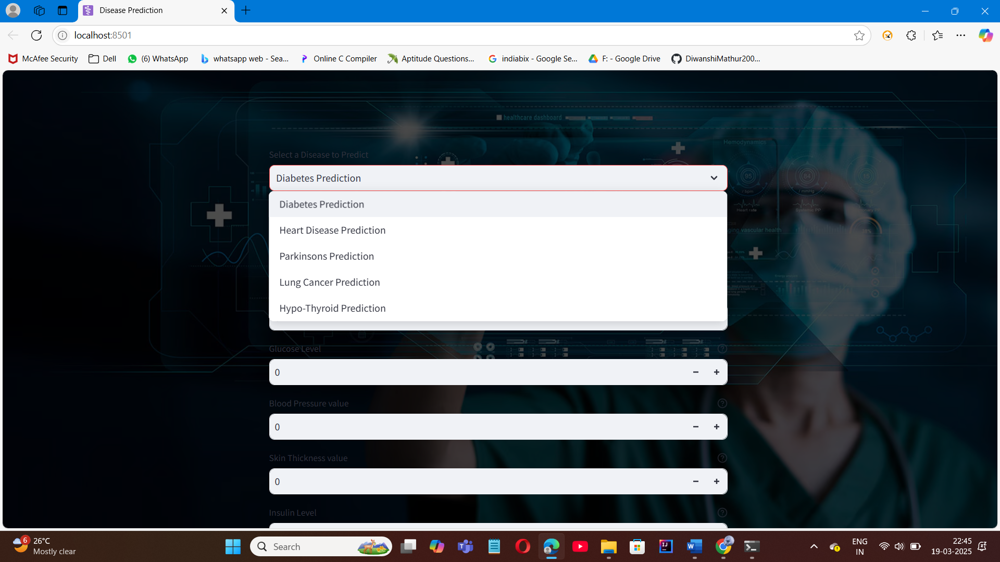
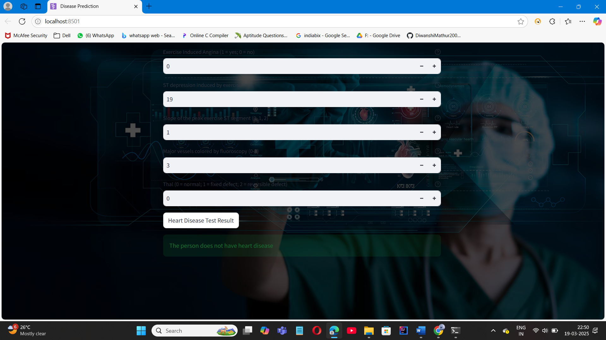

# 🩺 AI-Powered Medical Diagnosis System

This project is an implementation of an intelligent system that predicts possible diseases based on symptoms entered by the user. It uses machine learning algorithms trained on a labeled dataset to suggest diagnoses, aiming to support early detection and better decision-making in healthcare.

---

## 📌 Problem Statement

Access to timely and accurate medical diagnosis is a challenge in many areas. Patients often rely on self-diagnosis or delayed consultations, which can lead to severe health outcomes. This project aims to provide a fast and intelligent tool to predict diseases based on symptoms using AI/ML techniques.

---

## ✅ Objectives

- Build a machine learning model to predict diseases from symptoms.
- Provide a simple user interface for users to input symptoms.
- Display the most likely diagnosis with confidence level.
- Improve accessibility to basic diagnostic support using AI.

---

## 🧠 Technologies Used

- **Python 3**
- **Pandas, NumPy**
- **Scikit-learn**
- **Flask** (for the web interface)
- **HTML/CSS/Bootstrap** (for the frontend)
- **Matplotlib / Seaborn** (for evaluation and visualization)

---

## 📂 Dataset

- **Source:** Kaggle or open medical datasets
- **Content:**  
  - Symptoms (features)  
  - Disease label (target)  
  - Optional: Age, gender, etc.

---

## 🔄 Model Workflow

1. **Data Preprocessing**
   - Handle missing values and inconsistencies
   - Encode categorical values (symptoms/diseases)

2. **Model Training**
   - Algorithms used: **Random Forest**, **Naive Bayes**
   - Split into training and test sets (80/20)
   - Evaluation: Accuracy, Precision, Recall, F1-Score

3. **Prediction**
   - User selects or types symptoms via the web interface
   - Model returns top predicted disease with probability/confidence

---

## 📸 Screenshots

### 📝 Symptom Input Form


### 🧾 Diagnosis Result Page


---

## 🚀 How to Run Locally

```bash
# Clone the repo
git clone https://github.com/YourUsername/MedicalDiagnosisAI.git

cd MedicalDiagnosisAI

# (Optional) Create virtual environment
python -m venv venv
venv\Scripts\activate  # Windows
source venv/bin/activate  # Mac/Linux

# Install dependencies
pip install -r requirements.txt

# Run the app
python app.py
